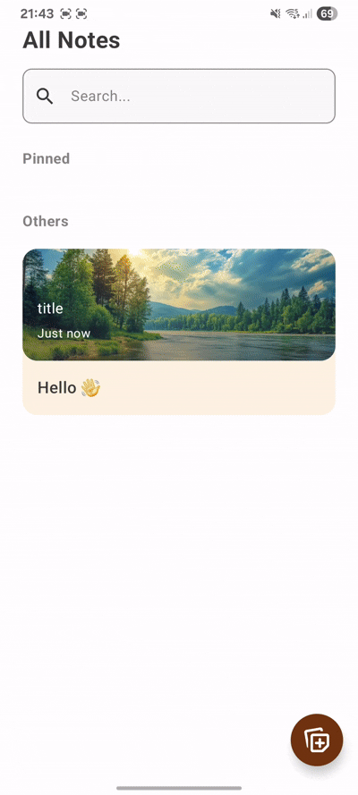
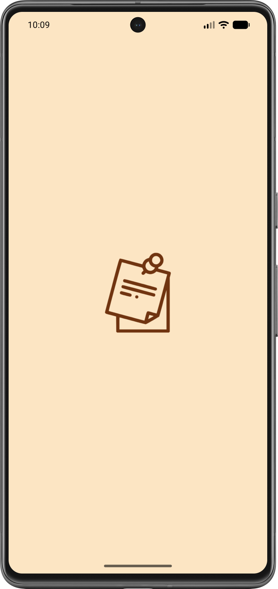
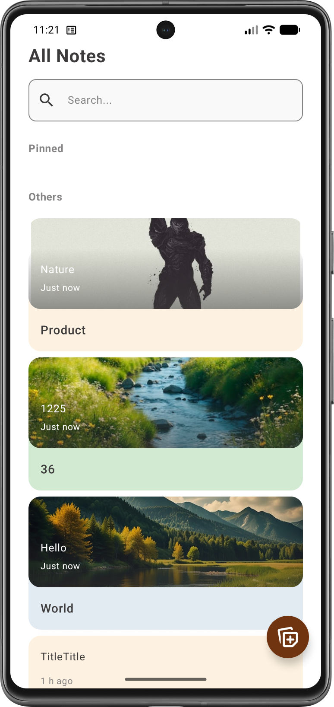
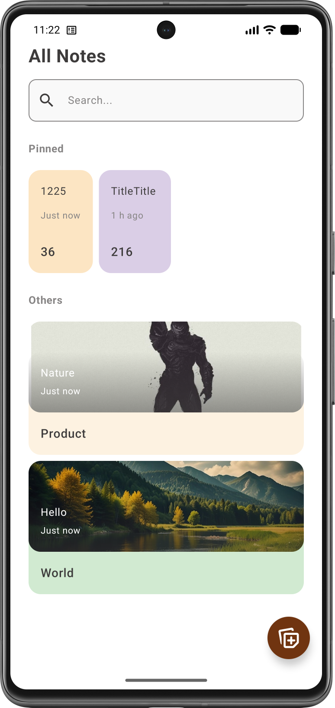
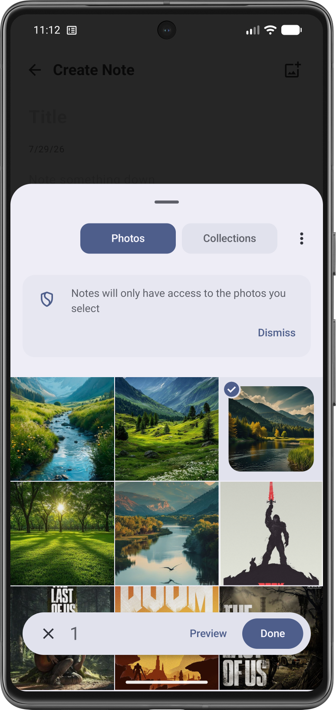
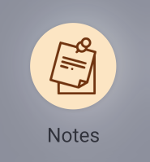
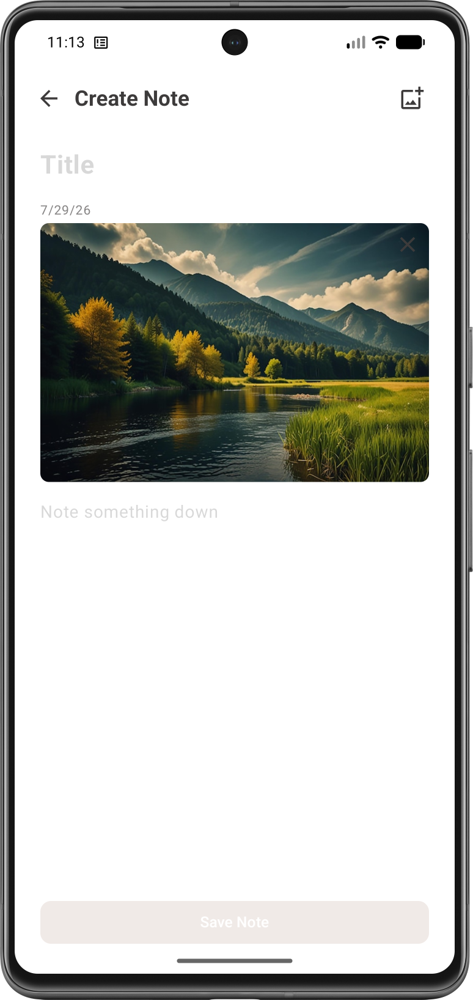

# 📝 Заметки

Простое, быстрое и удобное приложение для создания заметок с поддержкой изображений. Закрепляйте важное, ищите нужное мгновенно и держите всё под рукой.

---

## ✨ Основные возможности

- **📌 Закрепление заметок** — важные заметки всегда наверху списка. Закрепите в один тап и так же легко открепите, когда надобность пройдёт.
- **➕ Создание и удаление** — добавляйте новые заметки за секунды, удаляйте ненужные через кнопку на верхней панели.
- **🔍 Мгновенный поиск** — находите любую заметку по содержимому текста или заголовка. Поиск работает сразу при вводе.
- **🖼️ Изображения в заметках** — прикрепляйте одно или несколько фото. При добавлении двух и более изображений они автоматически группируются в аккуратную галерею. Ненужное изображение можно удалить отдельно.
- **👀 Предпросмотр в списке** — на главном экране каждая заметка показывает первое прикреплённое изображение и первые строки текста, чтобы вы легко ориентировались в своих записях.
- **🎨 Современный интерфейс** — полностью на Jetpack Compose, с плавными анимациями и лаконичным интерфейсом.

---

## 🛠 Технологический стек

---

## 🧱 Архитектура

Приложение построено по принципам **Clean Architecture** с разделением на слои `data`, `domain` и `presentation`. Внутри presentation используется паттерн **MVVM**, что обеспечивает чёткое разделение ответственности и лёгкость тестирования.

- **Data** — Room (локальная база данных), сохранение изображений в Internal Storage, репозитории.
- **Domain** — use cases для всех операций (добавление, удаление, поиск, закрепление).
- **Presentation** — Jetpack Compose UI, ViewModel, управление состоянием с помощью `StateFlow`.

Внедрение зависимостей осуществляется с помощью Hilt. Splash Screen API формирует начальный экран до загрузки данных. Для загрузки изображений используется Coil с дисковым и кэш-памятью.

---

## 🎥 Демонстрация работы

  
   
  <em>Редактирование заметки, добавление изображения и управление закреплением.</em>

---

## 📸 Скриншоты

| Экран загрузки | Список заметок | Закрепление заметки |
| :-----------: | :----------------: | :--------------------: |
|  |  |  |

| Добавление изображения | Иконка приложения | Добавление заметки |
| :-----------: | :----------------: | :--------------------: |
|  |  |  |

---

## ⚙️ Использование

| Действие | Как выполнить |
|----------|---------------|
| **Создать заметку** | Нажмите кнопку FAB на главном экране и введите текст и заголовок. |
| **Добавить изображения** | В режиме создания или редактирования коснитесь иконки «Добавление изображения» и выберите фото. Они сгруппируются автоматически. |
| **Удалить изображение** | В редактировании заметки нажмите на крестик в углу ненужного фото. |
| **Закрепить / открепить** | На главном экране выполните долгое нажатие на заметке, чтобы сменит ее статус. |
| **Искать по тексту** | Сверху главного экрана есть строка поиск, вводите текст и заметки отфильтруются мгновенно. |
| **Удалить заметку** | Откройте заметку и нажмите кнопку «Удалить» в контекстном меню. |
| **Редактировать** | Нажмите на заметку в списке, чтобы открыть экран редактирования. |

---

## 🚀 Быстрый старт

1. Перейдите в раздел [**Releases**](https://github.com/kerikir/NotepadStepik/releases).
2. Скачайте последнюю версию APK-файла (`Notes.apk`).
3. **Установка:**
   - Откройте загруженный файл.
   - При необходимости разрешите установку из неизвестных источников:  
     `Настройки → Безопасность → Неизвестные источники` (включите переключатель).
   - Следуйте инструкциям на экране.
4. Запустите «Заметки» с иконки на рабочем столе.

---

